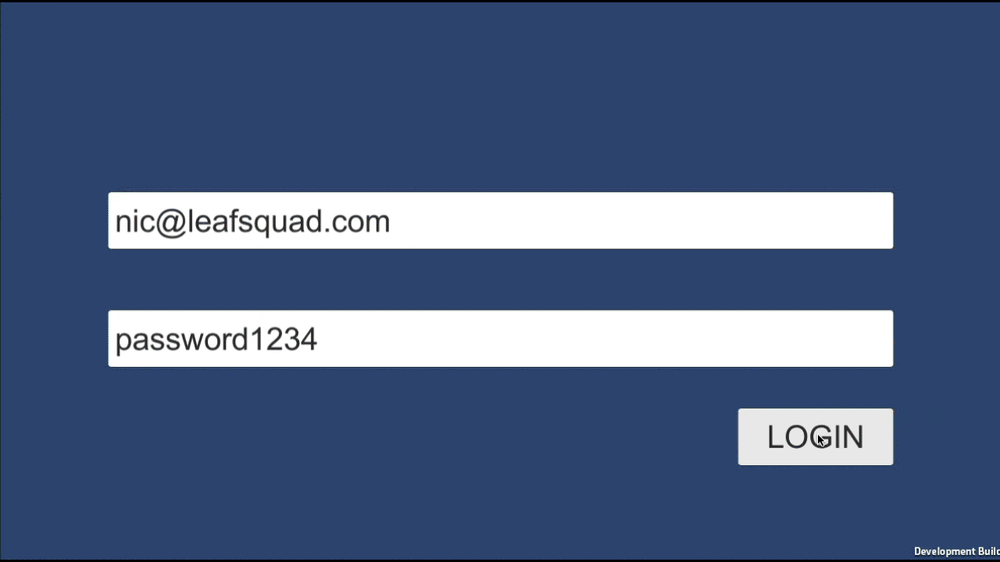

# Leaf Squad - Unity Instructions

These are instructions for building and running the Leaf Squad game with Unity.

## Requirements

- Unity 2021.2.0b1
- Unity Realm SDK 10.2.1
- MongoDB Atlas with Realm Application Configured

While this project might work with other versions of Unity, Realm, and Atlas, they have not been tested.

## Installation

There are a few steps to get the project working. Note that this document is strictly for Unity, not for configuring MongoDB Atlas and beyond.

**Step 01:**

Clone the project to your local computer.

**Step 02:**

Open the project with the correct version of Unity.

**Step 03:**

When warned while opening the project, choose to continue and then choose to enter safe mode. This is because the Realm SDK paths will not be correct and need to be fixed.

**Step 04:**

While in Unity's safe mode, choose **Window -> Package Manager**. If not already selected, choose **Packages: In Project** from the top left near the plus button. 

**Step 05:**

Remove the **Realm** package which will likely have an error. Once removed, click the plus icon and choose to install Realm from a tarball file. The Realm SDK can be found at the root of the cloned project.

**Step 06:**

Save and exit safe mode. It is possible that Unity will exit safe mode automatically when the Realm dependency is resolved.

**Step 07:**

Within the project's **Assets/Scripts/RealmController.cs** file, change the `RealmAppId` variable to reflect that of your actual Realm project.

**Step 08:**

Build, Run, or Preview and everything should work great!

## Main Contributors

- [Nic Raboy](https://www.nraboy.com)
- [Sig Narvaez](#)
- [Roy Kiesler](#)
- [Charles Van Parys](#)
- [Andrew Chaffin](#)
- [Beau Peck](#)